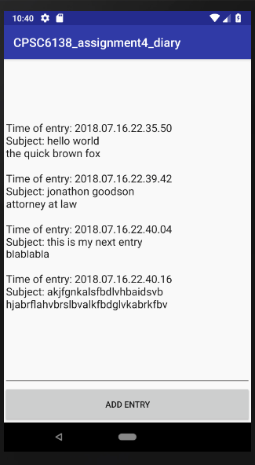

# CPSC6138\_assignment4_diary

by Jonathon Goodson

This app is a rudimentary diary app for Android.

## How To Use
The user is first greeted with a sign in screen.  If he or she has never configured a password (i.e. "signed up"), no set of credentials will allow him or her to enter the app; the user must click the `Sign Up` button to create a username and password.

Upon successfully authenticating, the user is presented with all of his or her diary entries.  To create a new entry, click `ADD ENTRY`.

